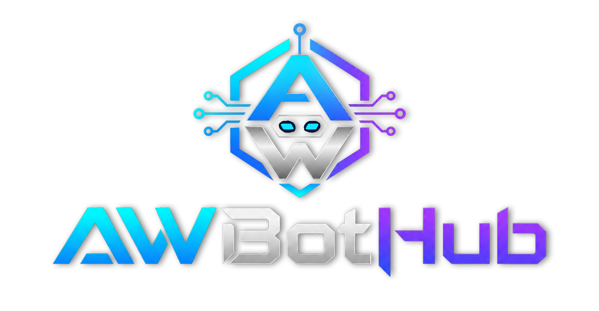

<div align="center">
  

  # AWBotNest

  一个 Telegram 机器人平台。所有功能都是**插件**——在网页控制台里点几下就能安装、开关，不用懂代码、不用重启。
</div>

## 它能做什么

- 🧩 **插件即功能**：想要什么功能就装什么插件，开关一点立即生效。
- 🛒 **插件市场**：内置官方插件仓库，也能添加你自己的 GitHub 仓库，浏览后一键安装。
- 👤 **多账号**：在网页上用手机号登录你的 Telegram 账号，可同时管理多个，随时上线/下线。
- 🖥️ **网页控制台**：插件、账号、日志、定时任务、设置，全在一个深色界面里管理。
- 🔒 **安全可控**：插件从市场下载后不会自动运行，必须你亲手开启才生效。

## 安装运行（推荐 Docker）

确保装好了 [Docker](https://docs.docker.com/get-docker/)，然后在项目目录执行：

```bash
docker compose up -d
```

启动后打开浏览器访问 **http://服务器IP:18001** 即可。

> 想换端口、用 MySQL 等，编辑 `docker-compose.yml`。运行数据都存在 `data/` 目录，删容器不丢数据。

## 第一次使用

1. **登录控制台**：默认账号 `admin`，密码 `password`。进去后请到「系统设置 → 控制台登录」**马上改掉密码**。
2. **填 Telegram 凭据**：到「系统设置 → Telegram 凭据」，填入从 [my.telegram.org](https://my.telegram.org) 申请的 `API_ID` / `API_HASH`，机器人功能再填 [@BotFather](https://t.me/BotFather) 给的 `BOT_TOKEN`。保存后重启平台生效。
3. **登录你的 Telegram 账号**：到「账号管理」，按提示输入手机号 → 验证码 →（如有）两步验证密码，完成登录。
4. **装插件**：到「插件管理 → 插件市场」，挑想要的插件点「安装」，再回「我的插件」打开它的开关。完事。

## 日常使用

- **插件管理**：`我的插件`看已安装的、开关/配置/删除；`插件市场`浏览并安装新插件。每个插件的「配置」按钮就是它的设置面板。
- **账号管理**：登录、查看、上线下线、删除 Telegram 账号。
- **运行日志**：实时查看平台和插件的运行日志，可按级别/关键词过滤。
- **系统状态**：账号在线情况、已加载插件、定时任务、近 24 小时活跃情况。
- **系统设置**：控制台登录密码、Telegram 凭据、Web 控制台、代理、数据库、插件仓库地址。

## 想自己写插件？

一个插件就是一个 `.py` 文件。最简单的样子：

```python
__plugin__ = {
    "name": "我的功能", "id": "my_feature", "version": "1.0.0",
    "scope": "user",   # user=用你的账号 / bot=用机器人 / both=都用
}

async def setup(ctx):
    @ctx.on_message(ctx.filters.text)
    async def handler(client, message):
        await message.reply("收到")
```

写好后在「插件管理」点「上传插件」选这个文件，或放进 GitHub 仓库供市场安装。

详细教程见 **[插件开发指南](docs/PLUGIN_GUIDE.md)**，开发规范见 **[SPEC](docs/SPEC.md)**。

## 常见问题

**忘了控制台密码？** 删掉 `data/auth.json` 文件再重启，会恢复成默认 `admin / password`。

**装了插件但没反应？** 插件下载后默认是关闭的，要去「我的插件」打开开关。

**插件报错/标红？** 在插件卡片上能看到错误原因，多半是插件本身的问题，删掉重装或换一个即可，不影响平台和其他插件。

**数据存在哪？** 全在 `data/` 目录（配置、登录态、插件数据）。备份它就等于备份了整个平台。

---

需要技术细节、部署进阶或二次开发，见 [docs/](docs/)。
