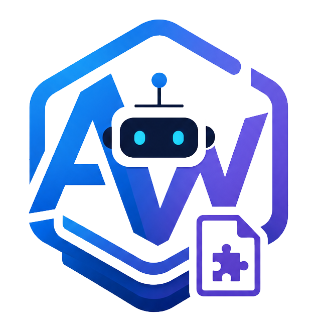

<div align="center">
  

  # AWBotNest V2

  一个支持 Telegram Bot 与用户账号的插件平台。安装、配置、更新和运行插件都可以在网页里完成。
</div>

## 它能做什么

- **插件即功能**：想要什么功能就装什么插件，开关一点立即生效。
- **插件市场**：内置官方插件仓库，也能添加你自己的 GitHub 仓库，浏览后一键安装。
- **多账号**：在网页上用手机号登录你的 Telegram 账号，可同时管理多个，随时上线/下线。
- **多 Bot 与路由**：可以接入多个 Telegram Bot，并为不同插件指定发送账号和通知渠道。
- **AI 服务**：统一配置文字、识图和生图模型，插件无需保存 API Key，也能限制每个插件可用的能力。
- **Cookie 服务**：支持浏览器 CookieCloud 直连和远程 CookieCloud 定时同步，插件按授权域名读取。
- **插件管理更完整**：支持版本更新、热重载、自检、运行诊断、日志查看和 Vue 配置界面。
- **开放 API**：可以让自动化脚本或其他服务管理插件、读取状态和发送 Telegram 消息。
- **网页管理**：插件、账号、日志、定时任务和设置，全在一个深色界面里管理。
- **安全可控**：插件从市场下载后不会自动运行，必须你亲手开启才生效。

## 安装运行（推荐 Docker）

在 Linux 服务器执行下面这一条命令：

```bash
curl -fsSL https://raw.githubusercontent.com/AWdress/AWBotNest/v2/install.sh | sudo bash
```

运行后会直接询问安装位置和访问端口，直接按回车会使用默认目录 `/opt/AWBotNest` 和默认端口 `18001`。脚本会自动检查并安装 Docker、拉取最新镜像、创建持久化目录并启动 AWBotNest。

运行数据会保存在你选择的安装目录中。以后重新执行同一条命令并选择原来的目录，即可拉取最新镜像并更新容器，已有数据不会丢失。

> 如果已经安装 Docker，脚本会直接使用，不会重复安装。需要调整代理或其他高级选项时，可以编辑所选安装目录里的 `docker-compose.yml`，然后在该目录执行 `docker compose up -d`。

## 第一次使用

1. **设置管理员账号**：首次打开网页时，直接设置管理员用户名和密码，保存后自动进入。
2. **填 Telegram 凭据**：到「系统设置 → Telegram 凭据」，填入从 [my.telegram.org](https://my.telegram.org) 申请的 `API_ID` / `API_HASH`。需要 Bot 时，再添加 [@BotFather](https://t.me/BotFather) 给出的 Bot Token。保存后重启生效。
3. **登录你的 Telegram 账号**：到「账号管理」，按提示输入手机号 → 验证码 →（如有）两步验证密码，完成登录。
4. **装插件**：到「插件管理 → 插件市场」，挑想要的插件点「安装」，再回「我的插件」打开它的开关。完事。

## 日常使用

- **插件管理**：`我的插件`查看、开关、配置、更新和删除插件；`插件市场`浏览并安装新插件。插件异常时可以直接查看日志、自检或运行诊断。
- **账号管理**：登录、查看、上线下线和删除 Telegram 用户账号，并管理多个 Bot。
- **运行日志**：实时查看系统和插件的运行日志，可按级别/关键词过滤。
- **系统状态**：查看 CPU、内存、账号在线情况、已加载插件、定时任务和插件使用趋势。
- **AI 服务**：添加兼容 OpenAI 接口的服务商，读取模型列表，并分配文字、识图和生图模型。
- **Cookie 服务**：配置浏览器直连或远程同步，查看 Cookie 数量、同步状态与最近同步记录。
- **通知服务**：支持 Telegram、企业微信、Bark 和 Webhook，并能为插件单独设置通知路由。
- **系统设置**：管理登录密码、Telegram 凭据、网页端口、代理、插件仓库、开放 API 和备份恢复。

## 想自己写插件？

一个插件就是一个 `.py` 文件。最简单的样子：

```python
__plugin__ = {
    "name": "我的功能", "id": "my_feature", "version": "1.0.0",
    "scope": "user",   # user=用户账号 / bot=机器人 / both=都用 / standalone=独立运行
}

async def setup(ctx):
    @ctx.on_message(ctx.filters.text)
    async def handler(event):
        await event.reply("收到")
```

写好后在「插件管理」点「上传插件」选这个文件，或放进 GitHub 仓库供市场安装。需要更丰富的设置界面时，也可以为插件提供 Vue 页面。

详细教程见 **[插件开发指南](docs/PLUGIN_GUIDE.md)**，开放接口见 **[API 文档](docs/API.md)**，开发规范见 **[SPEC](docs/SPEC.md)**。

## 常见问题

**忘了密码？** 删掉 `data/auth.json` 文件并重启，再按首次使用页面重新设置管理员账号。

**装了插件但没反应？** 插件下载后默认是关闭的，要去「我的插件」打开开关。

**插件报错/标红？** 打开插件菜单中的「查看日志」「插件自检」或「运行诊断」，可以直接查看失败原因，不影响系统和其他插件。

**AI 服务为什么不能用？** 读取服务商模型后，需要把模型添加到模型库，勾选能力，再到“模型分工”设置默认模型。

**CookieCloud 配置好了但没有数据？** 点击“检查状态”查看结果；浏览器直连需要在扩展中选择上传到服务器，远程模式可以点击“立即同步”。

**数据存在哪？** 设置和插件数据在 `data/`，Telegram 登录状态在 `sessions/`，已安装插件在 `plugins/`。备份这三个目录就等于备份了全部数据。

---

需要技术细节、部署进阶或二次开发，见 [docs/](docs/)。
